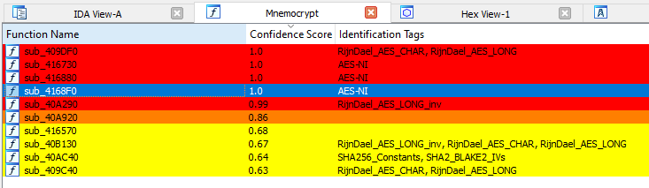

## About the tool
<em>Mnemocrypt</em> is a random forest classifier for the detection of cryptographic functions in x86 and x86-64 executables. It works as an IDA Pro plugin. For every function in a binary, it computes a set of features based on the structure of the function and on statistics about its assembly instructions (mnemonics), then predicts whether the function is cryptographic and gives a confidence score between 0 and 1. When combined with a slightly modified version of Findcrypt3 (included in this repository), it can also show partial cryptographic identification (for example AES or SHA). The tool was tested on IDA Pro 9.0 with Python under Windows with WSL.

Mnemocrypt is based on the original tool by Simone Aonzo (<a href="https://github.com/theneonai/mnemocrypt">https://github.com/theneonai/mnemocrypt</a>) and on the research paper <em>Mnemocrypt: A Machine Learning Approach for Cryptographic Function Detection in x86 Executables</em>.

<strong>This repository is an assigned semester project built on top of the original Mnemocrypt tool. It is not affiliated with the original research paper or its authors.</strong>

## About this project
This is a semester project that tried to improve the original Mnemocrypt in a few directions. The results are modest and are summarized in the next section.

- <strong>x86-64 support.</strong> The original tool handled x86 (32-bit) binaries only. The training set and the feature computation were changed to also cover 64-bit binaries.

- <strong>Fewer false positives.</strong> The original training set contained cryptographic libraries only, so the tool flagged many compression and data-processing functions as cryptographic. The training set now also includes goodware: compression libraries (zlib, lzma, zstd, brotli, lz4, snappy, bzip2) and other non-cryptographic libraries (libpng, libjpeg, freetype, libxml2, lua, leveldb).

- <strong>Vectorized instruction counting.</strong> A vectorized (SIMD) instruction works on several values at once. The project tried counting it as several occurrences, based on the number of data lanes it uses (the register width divided by the element size). For example, `paddd xmm0, xmm1` adds four 32-bit values in one step, so it is counted as four occurrences instead of one.

- <strong>Operand-level features (experiment).</strong> The project also tried reading instruction operands: immediate constants (for example the SHA-256 value 0x6a09e667) and references to large lookup tables (for example AES S-boxes, detected by their size and byte entropy). These features helped on the training libraries but lowered detection on real malware, so they are not part of the deployed model. The reference implementation, explanation, and result are preserved as a commented section in <em>./common/internal_compute_features.py</em>.

The model keeps the original confidence threshold of 0.5.

## Results
The numbers below come from the tests run during this project, comparing the original model, the deployed model from this project, and the later operand-feature experiment. The held-out goodware is a set of clean (non-cryptographic) programs that the model was not trained on, so every detection on it is a false positive. The labeled holdout is a 20% split of the training set.

| Measure | Original model | This project (deployed) | Operand features (not deployed) |
|---|---|---|---|
| False positives on held-out goodware (1481 functions) | 48 | 9 | 7 |
| Malware binaries where cryptography was found (out of 231) | 84 | 86 | 87 |
| Malware function detections | 909 | 962 | 495 |
| Precision on the labeled holdout | 0.60 | 0.86 | 0.86 |
| Recall on the labeled holdout | 0.25 | 0.46 | 0.47 |

Recall is still around 0.46, so the tool still misses about half of the cryptographic functions. The operand-level experiment slightly improved held-out precision/recall and reduced false positives, but it did not transfer to real malware: it dropped from 962 malware function detections to 495, while the number of binaries with at least one detection stayed comparable. For that reason, the operand-feature model is documented as research but is not shipped.

## Example of output of Mnemocrypt plugin in IDA GUI


When you run the plugin, it shows a table of the functions it classified as cryptographic, with their confidence scores. The rows are colored by confidence, and clicking a row jumps to the function in IDA.

- Coloring convention:
  - yellow: confidence score 0.5-0.75
  - orange: confidence score 0.75-0.95
  - red: confidence score 0.95-1.0

- The minimal confidence score and the coloring convention can be changed in the plugin script <em>mnemocrypt.py</em>.

## Setup
In this README, "./" stands for the root directory of the repository.

1. Install the Python modules with `python -m pip install -r requirements.txt` (Python 3.9.2 is recommended). The Findcrypt plugin requires `yara-python`; install the requirements in the same Python environment used by IDA if your IDA installation uses a separate Python.
2. If you use IDA under Linux, or under Windows with WSL, run `./prepare_environment.sh` and answer the prompts. This initializes the variables used by the scripts. If this does not work for your setup, set the <strong>idat_path</strong> variable (absolute path to idat.exe) in <em>./common/building_wrapper.sh</em> and <em>./tool/plugin_batch.sh</em>.
3. Set the <strong>repository_dirpath</strong> variable (the path to this repository) in <em>./move_to_ida_plugins/mnemocrypt.py</em> and <em>./move_to_ida_plugins/findcrypt3.py</em>. The plugin needs this to find the model and the computed features.
4. Move the files from <em>./move_to_ida_plugins/</em> into the IDA plugins directory (for example C:\\Users\\john\\Programs\\IDA_Pro_9.0\\plugins).
5. <strong>Disable your antivirus</strong> before generating the IDA databases of the malware samples, because it can interfere with the generation. You can re-enable it once all the databases are built.

## How to use Mnemocrypt on IDA Pro
Mnemocrypt runs as an IDA Pro plugin. The plugin reads features that were computed beforehand by the scripts, so the features of a binary have to be computed before the plugin can classify it.

#### On the provided malware dataset
1. Place the separately provided `data.zip` archive at the repository root.
2. Run `./quick_start.sh` once. It unzips the data, builds the IDA databases, computes the features, and runs Findcrypt on the samples. Expect this to take a few hours.
3. Open one of the generated IDA databases in IDA Pro.
4. Run the Mnemocrypt plugin (shortcut Ctrl-Alt-M, or "Mnemocrypt" in the plugin menu). It shows the table of cryptographic functions described above.
5. To get the results for every sample at once instead, run `./tool/plugin_batch.sh mnemocrypt` and read the exported results in <em>./tool/mnemocrypt_predictions.csv</em>.

#### On your own binary
1. Place the binary in <em>./tool/raw_executables/</em>.
2. Run `./common/building_wrapper.sh databases` then `./common/building_wrapper.sh features` to build its IDA database and compute its features.
3. Open the binary in IDA Pro and run the plugin as above.

#### Notes
- The pre-trained model and the datasets are large and are not stored in the git repository. To use the plugin, place a trained model at <em>./common/trained_mnemocrypt.pkl</em>; it can be supplied separately or rebuilt with `python ./training/train_mnemocrypt.py` after generating the training feature CSVs. The malware quick-start requires a separately supplied <em>data.zip</em> archive at the repository root.
- Mnemocrypt is independent from Findcrypt in its approach, so it can run without Findcrypt installed. Findcrypt adds the cryptographic identification information (the byte patterns it matches) on top of what Mnemocrypt detects on its own.

## Repository structure
The layout follows the original repository. The files and directories added for this project are marked with `[added]`, and the modified ones with `[modified]`.

```C
mnemocrypt/
|-- common/                                 // Shared code and data for both training and detection
|   |-- building_wrapper.sh                  // Builds IDA databases or computes features
|   |-- internal_compute_features.py         // [modified] Feature computation (x86-64, lane-based vectorized counting)
|   |-- categories.json                      // Mnemonic categories and their roots
|   |-- prepared_roots.json                  // Lookup table used for mnemonic matching
|   |-- root_prefixes.json                   // Mnemonic prefixes used during matching
|   |-- training_set_basenames_listing.txt   // [modified] Basenames of the training set (now 90 binaries)
|   `-- trained_mnemocrypt.pkl               // Trained model (generated by train_mnemocrypt.py)
|
|-- training/                               // Training set labels and training script
|   |-- crypto_functions_names/              // [modified] Manually labeled cryptographic functions (new libraries added)
|   `-- train_mnemocrypt.py                  // [modified] Trains the random forest classifier (SMOTE ratio, logging)
|
|-- tool/                                   // Detection on the binaries under study
|   |-- internal_findcrypt_batch.py          // Runs the modified Findcrypt on a binary and exports results
|   |-- internal_mnemocrypt_batch.py         // Runs Mnemocrypt on a binary and exports results
|   `-- plugin_batch.sh                      // Runs Findcrypt or Mnemocrypt on all binaries
|
|-- move_to_ida_plugins/                    // Files to move into the IDA plugins directory
|   |-- mnemocrypt.py                        // Mnemocrypt plugin
|   |-- findcrypt3.py                        // Modified Findcrypt3
|   `-- findcrypt3.rules                     // Findcrypt rules (crypto signatures)
|
|-- doc/                                    // Additional documentation
|
|-- quick_start.sh                          // Unzips data, builds databases, computes features, runs the plugins
|-- prepare_environment.sh                  // Initializes the script variables
|-- requirements.txt
`-- README.md
```
